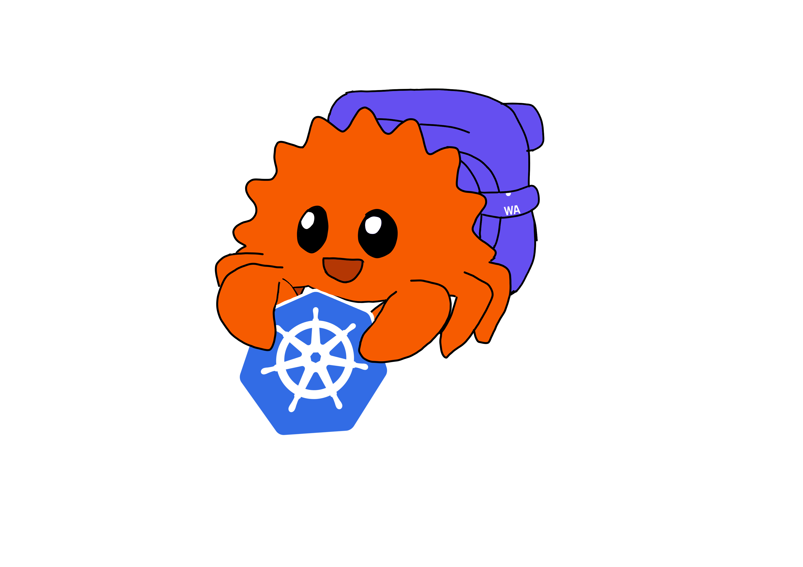

# Notes - Meeting 11/12/24

## Preparation
### Current progress
#### WASM-prototype
- PR: Clean up code using formatters and linters and document which are used
  - <https://github.com/idlab-discover/wasm-operator/pull/5>
- PR: Document the commands used in the `run_wasm.sh` file
  - <https://github.com/idlab-discover/wasm-operator/pull/6>
- Feedback WASM-prototype
  - The comb-rust-controller, ring-rust-controller and simple-rust-controller are all very similar
    -> Would combine them into one
  - Several of the project in controllers are not actual operators
  - Add ability to create child operators at runtime
    - Seems very doable since should just be able to send a StartModule command
    - Would allow us to create a CD pipeline that creates the Docker images
  - Change sh files to work from the Setup process, instead of doing it themselves
    - Would simplify the files -> more understandable
    - Would reduce the burden of keeping them up to date (easier to update docs then several shell files)
  - Create guidelines on how a operator is supported
  - Ci/cd on Github
  - Pre-commit

#### PoC
- Mock-up
  - Functions in Reconcile Percona MongoDB operator
    - Gives realistic environment
    - By only implementing a few functions, scope can be kept manageable
  - Was mistake documenting each function however
    - Can be useful in the long term (if I want to expand the example to be more indicative, but took a lot of time)
- "Add Methods" solution
  - Wrapper functions
    - Handle API objects
    - Handle storing overview secondary resources
    - Handle watches / ownership (in progress)
  - Use traits
    - Easy to implement
    - Create sort of "expansion pack"
      - Easier to implement in existing solutions
- Seems very valuable to split the reconciles
  - Have to watch out for race conditions however
- Maybe the ability to separate reconciles to different WASM instances
    -> Some could be scheduled reconcile if necessary (could allow for further optimizations such as loading back into memory at the right time)

#### Miscellaneous
- Create a logo (first draft)
  - 

### Subjects to discuss
- Feedback prototype
- Presentation (planning in particular)
- Current setup PoC
- Future goals PoC
  1. Improve Kubernetes API integration
    - 1 request -> all secondaries
    - Predicate support
  2. Separate Reconcile functions
    - Specialization -> better prediction
    - Investigate splitting into different WASM contexts
  3. Kubebuilder support?
    - Go support is coming to prototype
    - Rust -> Go should be simpler
    - Doesn't seem like "research" important to thesis

## Meeting
### Improving the dev experience of the WASM operator prototype
All seem like valid points, most of the discussion was about the merging of the operators:

The minor differences are on how they call the other operators (e.g. ring pattern).
Combining could make the operators quite large, influencing the benchmarks.  
-> Shouldn't be important as long as it is compared to the non-WASM environment.  
-> Can (maybe) be mitigated by using [conditional compilation](https://doc.rust-lang.org/reference/conditional-compilation.html)
Difference has to stay clear!

Would allow controller to be more maintainable and a better starting example.

### Feedback presentation
#### Font
Don't use UGent Panno Text -> issues when not installed on the computer
-> Use secondary font (Arial)

#### Structure
Global structure needs some work.
The content isn't a story -> jumps from one place to another.

Normal structure:
1. What is the context
2. What will you do (the goals)
3. What have you done (the progress)
   - Can include more technical section on Poc
4. What will be next (planning / the future)

Concrete for my presentation that means
- Add slide on Cloud Native / Kubernetes in Edge Context and how it uses too many resources (broad context) (can be 20 sec or so)
- Make a clear separation where previous work ends and my progress starts
- First mention period wake-up, then why that is a problem (expensive)
  - And explain why being expensive is a problem
- Move the goals earlier (after slide 4)
  - In my case, this would be best done with a new slide
    - Finding the source of the problem
    - Developing potential solution
    - Working on the prototype
  - Very general, high level
- Possible solutions + goals with project have to be combined
  - Or at least, placed together
  - Best combined with a separate slide providing structure
- Thorough explanation of current state solution after the PoC slide
  - Can be a lot more technical than Progress slide
  - Progress should just introduce it

#### Planning
Start from the back:
- What has to be done before deadline
  - Stay high level
    1. Extended abstract
    2. Benchmarks + Evaluation chapter
    3. Kubebuilder support
    4. Separate Reconcile
    5. K8S API integration
    6. Watches in PoC
- This is then a general planning,
but doesn't include writing chapters on each of these topics of course
- Start assigning time, starting with tasks with a minimum time required
    1. Extended abstract (1 week)
    2. Benchmarks + Evaluation chapter (2 weeks)
    3. ...
- Dates follow
- Include optional goals
  - Can be removed if behind on schedule

### Mascot
The mascot may definitely be used, but the appropriate sources have to be mentioned.
See [RustiFlow](https://github.com/idlab-discover/RustiFlow) as an example.
